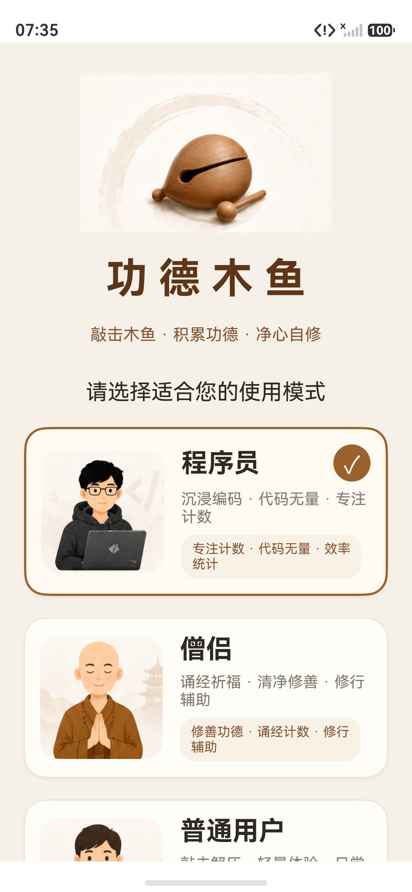
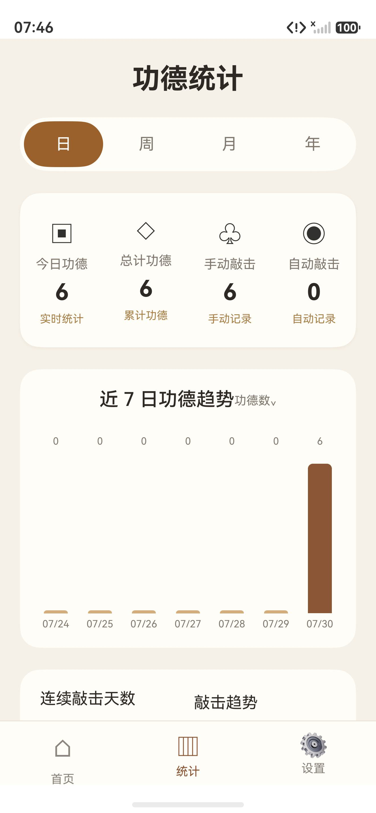
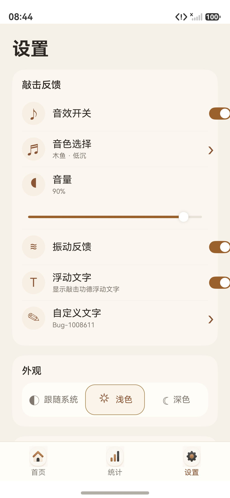
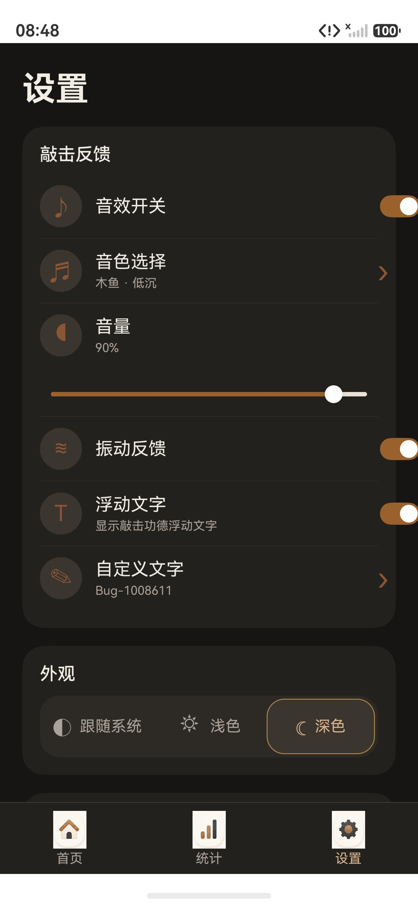
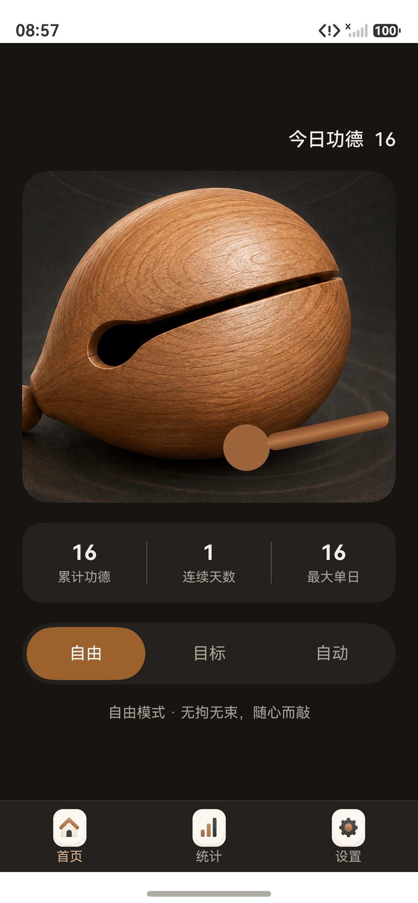
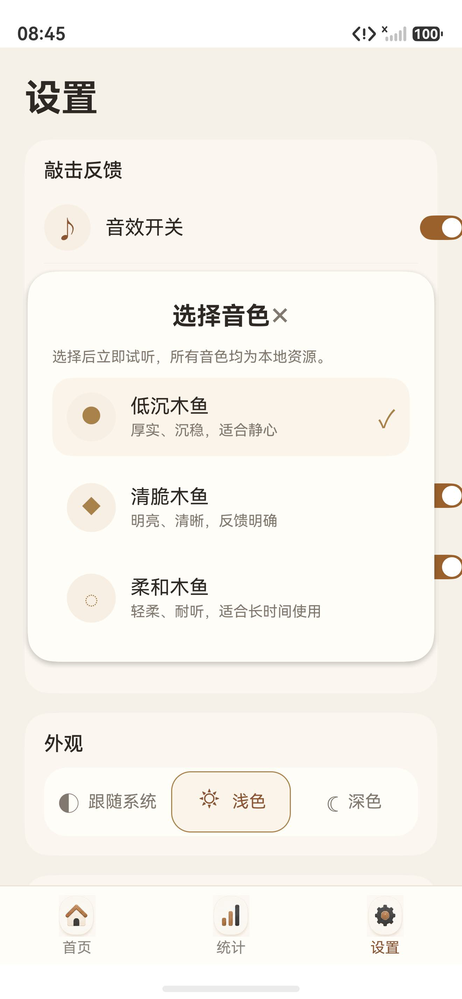

# 敲敲木鱼

HarmonyOS NEXT 原生单机电子木鱼：敲一下、计一次，全部功能离线运行；不申请网络权限，无登录、广告、支付与云同步，敲击记录只留在本机。

## 技术栈

- HarmonyOS NEXT，兼容与目标 SDK `6.0.2(22)`，Stage 模型，ArkTS / ArkUI 声明式 UI，`entry` 单 HAP 模块
- 设备类型：phone、tablet、2in1（同一份代码按 600vp / 1024vp 断点限宽重排）
- 无第三方运行时依赖，仅本地 OHPM 依赖（测试用 `@ohos/hypium`）
- 本地持久化：`@kit.ArkData` Preferences，设置与每日统计各以 JSON 字符串保存，解码时逐字段校验并夹取取值区间
- 音效：`@kit.MediaKit` SoundPool（8 路并发、音乐流用途）加载三份本地 wav；`InitializationSlot` 管理初始化代次，后台或重建时释放声音池
- 振动：`@kit.SensorServiceKit` 短时振动，仅在开关开启时触发
- 系统栏：`WindowChromeService` 绑定窗口后按当前页签与明暗解析状态栏 / 导航栏配色，重复样式去重

## 功能特性

**敲击与反馈**

- 木鱼主体与木槌分层：手动和自动敲击共用同一 `hitSequence`，驱动木槌落下、木鱼回弹、涟漪波纹、接触阴影与浮字四段动画
- 浮字最多同时三条，按新旧分层偏移与递减透明度，760ms 后自动消退
- 三档互斥敲击模式：自由、目标、自动；自动档再次点击即关闭，切换模式立即停止定时器
- 目标模式显示进度条与「目标达成 · 功德圆满」，可选择推荐目标次数（默认 108），达成后拦截额外敲击并显示提示
- 自动模式支持暂停 / 继续，显示本次已敲次数；自动间隔由设置中的 `autoInterval` 控制
- 反馈开关集中分组：音效开关、振动反馈、浮动文字、音量、音色选择与自定义文字

**音色与外观**

- 低沉 / 清脆 / 柔和三种本地音色，选择后立即试听；音量 0–100% 可调，滑动过程中实时刷新显示，松手时落盘
- 自定义敲击文字：预设词条或 1–12 个字符的输入，带归一化与校验提示
- 三种主题：跟随系统、浅色、深色；系统栏与导航栏颜色按页签和主题统一（浅色首页状态栏 `#FAF4EF`、其他页 `#F6F1E8`、深色 `#171513`）
- 三档限宽布局：小于 600vp 单列铺满，600–1023vp 限宽 920，1024vp 以上限宽 1180 并加卡片阴影

**本地统计**

- 日、周、月三套统计口径，均从本地每日记录实时计算：日视图为近 7 日每日趋势（当日口径），周视图为近 8 周趋势（近 7 日口径），月视图为近 12 月趋势（本月口径）
- 当前口径敲击数、累计功德、手动敲击、自动敲击四张指标卡与柱状趋势图
- 首页显示当前敲击文字与今日计数、累计功德、连续天数、最大单日
- 连续天数口径：当天有记录从当天回溯，当天未敲则保留截至昨天的连续记录
- 清除所有数据需二次确认，确认按钮带 3 秒倒计时；确认后只清记录、保留当前设置

**说明与合规**

- 设置页内置隐私政策页：概述、数据存储、权限说明、第三方服务、儿童隐私、更新说明分节呈现
- 「关于应用」显示应用名与版本号 `1.0.0`
- 本地存储初始化或写入失败时，页面上方显示异常提示条，数据不会静默丢失

**无障碍与状态同步**

- 木鱼、模式档位、主题按钮、开关和音色面板均提供无障碍文字说明
- 开关与音量、音色、自定义文字在设置页实时响应式刷新，切换页签与系统主题变化时重新同步系统栏

## 截图

| 说明 | 截图 |
| --- | --- |
| 首页：木鱼、今日敲击与累计指标 |  |
| 统计：口径切换与趋势 |  |
| 设置：敲击反馈分组（浅色） |  |
| 设置：敲击反馈分组（深色） |  |
| 深色主题首页 |  |
| 音色选择面板 |  |

以上为开发阶段的手机模拟器运行记录，作为状态参考保留；最新的系统栏配色、木槌造型与统计布局证据记录在 `design-qa.md` 与 `docs/qa/`。

## 目录结构

```
AppScope/                     应用级配置、应用名与应用图标
entry/src/main/ets/
  pages/                      Index（导航与编排）、HomePage、StatsPage、SettingsPage、PrivacyPage
  components/                 WoodenFishView（木鱼与木槌动画）、BottomNavBar、StatsBarChart
  stores/                     AppRuntime、AppStore 应用级状态
  repositories/               SettingsRepository、StatsRepository 持久化
  data/                       PreferencesStore、LocalStoreAdapter、JsonCodec（设置与记录编解码、旧值迁移）
  services/                   SessionService、AudioService、VibrationService、StatsPeriodService、
                              WindowChromeService、InitializationSlot
  models/                     AppModels、Enums、SystemBarModels
  constants/                  DesignTokens、UserModeConfigs、AppVersion
  utils/                      ThemeResolver、SystemBarStyleResolver、DateUtil、TextValidator
entry/src/main/resources/
  base/media/                 木鱼主体、木槌、品牌图与底部导航图标
  base/element/               string / color 资源，rawfile/sounds 下三份敲击音效
entry/src/ohosTest/ets/test/  Hypium 用例（模型、数据与会话、统计周期、系统栏样式）
docs/                         design.md / design-qa.md / changes.md / tasks.md 与 docs/qa 证据
scripts/                      构建脚本：build-harmony.ps1 与 check-standard.ps1 及其子门禁
```

## 构建与运行

1. 安装 DevEco Studio 并配置 HarmonyOS SDK（兼容基线 API 22 / 6.0.2），`scripts/build-harmony.ps1` 默认从 `C:\Program Files\Huawei\DevEco Studio\sdk` 取 SDK 与 hvigor，可用 `-SdkRoot` 指定其他位置
2. 用 DevEco Studio 打开工程，选择 `entry` 模块的 `default` 产品，`debug` 或 `release` 模式直接运行
3. 或在项目根目录执行脚本：

```powershell
# 静态门禁（必需文件、应用名、浮字、木槌布局、暂停图标、启动流程与系统栏契约）
powershell -NoProfile -ExecutionPolicy Bypass -File .\scripts\check-standard.ps1
# debug 主 HAP
powershell -NoProfile -ExecutionPolicy Bypass -File .\scripts\build-harmony.ps1 -BuildMode debug
# debug 测试 HAP
powershell -NoProfile -ExecutionPolicy Bypass -File .\scripts\build-harmony.ps1 -BuildMode debug -Target ohosTest
# release 主 HAP
powershell -NoProfile -ExecutionPolicy Bypass -File .\scripts\build-harmony.ps1 -BuildMode release
```

构建产物位于 `entry/build/`，脚本会打印 HAP 路径与字节数。`check-standard.ps1` 的检查全部在仓库内自包含运行，只需 PowerShell，不依赖外部工具或网络。

打包前请先补齐或替换签名配置：当前 `build-profile.json5` 指向开发机本地的签名材料，仓库不包含证书与口令。

## 隐私说明

- `entry/src/main/module.json5` 只申请一项权限：`ohos.permission.VIBRATE`，用途为敲击时的触觉反馈
- 不申请网络权限，也不申请定位、存储、相机等权限；没有联网能力，因此不存在数据上传路径
- 不接入广告 SDK、WebView、登录、排行、支付或云同步
- 敲击记录、设置偏好和统计数据只以 Preferences 形式保存在本机，卸载应用即随之删除
- 隐私政策全文随应用提供（设置页 → 隐私政策）

## 许可

代码为个人作品，仓库未附开源许可文件，默认保留全部权利，请勿直接商用或二次分发。木鱼图片、导航图标与三份敲击音效为项目自有素材。